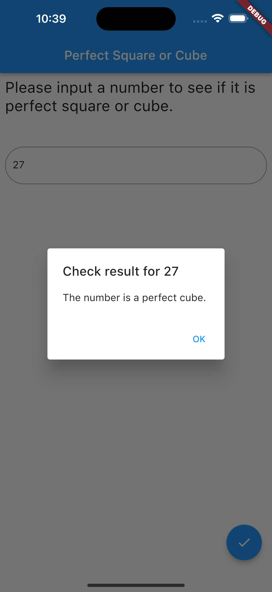
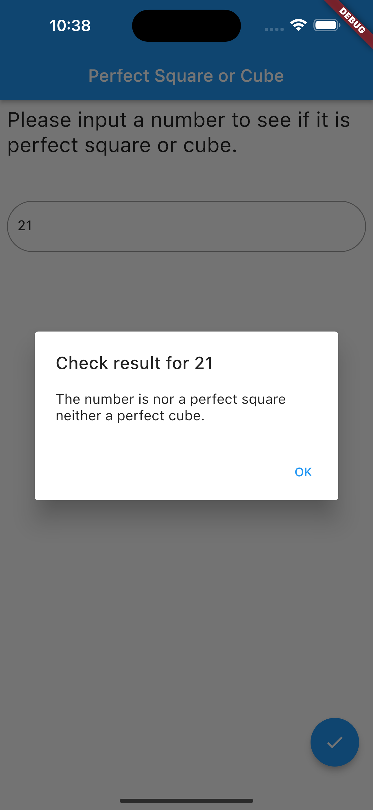

# Perfect Square or Cube

Check if a number is perfect square , cube , both or none of them.

## Screenshots

These are some screenshots from the app.

#### Landing page

#### Perfect Square

#### Perfect Cube

#### Perfect Square and Cube

#### Nor Perfect Square neither Cube

